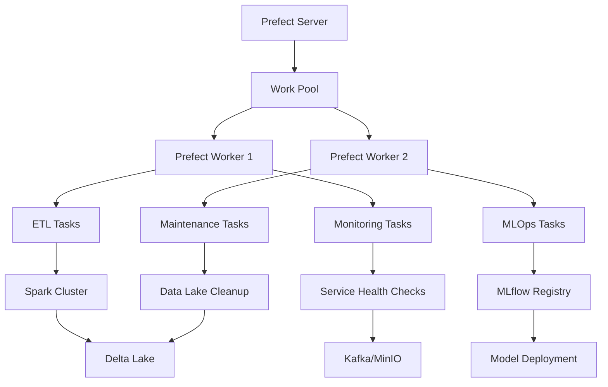

# 🚀 DataLab - Plataforma Unificada de Dados

<div align="center">
  
  
  
  
  
  
  
  
  
  
  
</div>

> **DataLab** é uma **plataforma unificada e robusta** para processamento, análise e machine learning de dados. Integra as melhores ferramentas do ecossistema de dados em uma arquitetura coesa e escalável, com orquestração centralizada via Prefect e gestão completamente unificada.

## 🌟 **Plataforma Unificada - Nova Arquitetura**

> **� EVOLUÇÃO COMPLETA**: O DataLab foi transformado em uma **plataforma verdadeiramente unificada** com arquitetura centralizada, CLI poderosa, monitoramento inteligente e gestão simplificada.

### ✨ **Principais Inovações**

- **🏗️ Core Platform**: Sistema centralizado de gerenciamento de todos os serviços
- **🎛️ CLI Unificada**: Interface de linha de comando completa (`datalab_cli.py`) 
- **📊 Dashboard Avançado**: Interface web integrada com monitoramento em tempo real
- **🔄 Orquestração Inteligente**: Gestão unificada de todos os pipelines via Prefect
- **🏥 Health Monitoring**: Verificações automáticas e métricas de todos os serviços
- **⚙️ Configuração Centralizada**: Sistema único de configuração para toda a plataforma
- **🧪 Testes Automatizados**: Suite completa de validação e qualidade

## � **Início Ultra-Rápido**

### **1. Setup Automático Completo** ⚡
```bash
# Clone e configure tudo automaticamente
git clone <repository-url> && cd datalab
./setup.sh && ./start_platform.sh
```

### **2. Acesso Imediato** 🌐
```bash
# Dashboard Principal (Interface Unificada)
http://localhost:8501

# Serviços Integrados
http://localhost:9001  # MinIO Console (admin/password123)
http://localhost:5000  # MLflow UI
http://localhost:8000  # JupyterHub (admin/admin) 
http://localhost:4200  # Prefect UI
http://localhost:4040  # Spark UI
```

### **3. Gestão Via CLI** 💻
```bash
# Status geral da plataforma
python datalab_cli.py platform status

# Executar pipeline ETL completo
python datalab_cli.py pipelines run medallion_etl

# Health check de todos os serviços
python datalab_cli.py platform health

# Gestão de serviços
python datalab_cli.py services list
python datalab_cli.py services restart spark
```
- **🗄️ Data Lake**: MinIO (storage S3-compatible + Delta Lake)
- **🧪 ML Tracking**: MLflow 2.22.0 (experimentos e model registry)
- **📊 Dashboards**: Streamlit 1.45.0 (interface web interativa)
- **📓 Notebooks**: JupyterHub 5.3.0 (ambiente colaborativo)
- **🐳 Containerização**: Docker Compose (orquestração de serviços)

### 🏛️ **Arquitetura Medallion Avançada**
- **🥉 Bronze**: Ingestão de dados brutos com metadados completos
- **🥈 Silver**: Dados limpos e transformados com validação de qualidade
- **🥇 Gold**: Agregações e métricas prontas para análise e ML
- **📈 Analytics**: Insights automatizados e relatórios inteligentes

## 📋 Componentes

| Componente       | Versão                       | Porta       | Descrição                              | Documentação                               |
| ---------------- | ---------------------------- | ----------- | -------------------------------------- | ------------------------------------------ |
| **Apache Spark** | 3.5.1                        | 8080, 7077  | Processamento distribuído de dados     | [Documentação](/docs/spark/README.md)      |
| **Delta Lake**   | 3.3.1                        | -           | Camada de armazenamento para lakehouse | [Documentação](/docs/spark/README.md)      |
| **MLflow**       | 2.22.0                       | 5000        | Plataforma de MLOps                    | [Documentação](/docs/mlflow/README.md)     |
| **MinIO**        | RELEASE.2025-04-22T22-12-26Z | 9000, 9001  | Armazenamento de objetos S3            | [Documentação](/docs/minio/README.md)      |
| **Prefect**      | 3.4.1                        | 4200        | Orquestração de fluxos                 | [Documentação](/docs/prefect/README.md)    |
| **Streamlit**    | 1.45.0                       | 8501        | Dashboards interativos                 | [Documentação](/docs/streamlit/README.md)  |
| **JupyterHub**   | 4.0.2                        | 8000        | Ambiente de desenvolvimento            | [Documentação](/docs/jupyterhub/README.md) |
| **Apache Kafka** | 7.5.0                        | 9092, 29092 | Streaming de eventos                   | [Documentação](/docs/kafka/README.md)      |
| **Apache NiFi**  | 2.4.0                        | 8443        | Automação de fluxo de dados            | [Documentação](/docs/nifi/README.md)       |
| **Consul**       | 1.16.0                       | 8500, 8600  | Service Discovery                      | [Documentação](/docs/ARCHITECTURE.md)      |
| **Prometheus**   | latest                       | 9090        | Monitoramento de métricas              | [Documentação](/docs/ARCHITECTURE.md)      |
| **Grafana**      | latest                       | 3000        | Visualização de métricas               | [Documentação](/docs/ARCHITECTURE.md)      |

## 🏗️ Arquitetura

A arquitetura do DataFlow Lab é baseada no padrão Medallion (Lakehouse), organizada em três camadas principais:

```
┌─────────────────────────────────────────────────────────────────────┐
│                          CAMADA DE INGESTÃO                         │
│                                                                     │
│  ┌──────────┐    ┌───────────┐    ┌────────┐    ┌────────────────┐  │
│  │  Apache  │    │  Apache   │    │  APIs/ │    │     Outros     │  │
│  │   NiFi   │    │   Kafka   │    │  REST  │    │    Coletores   │  │
│  └────┬─────┘    └─────┬─────┘    └───┬────┘    └────────┬───────┘  │
│       │                │               │                 │          │
└───────┼────────────────┼───────────────┼─────────────────┼──────────┘
        │                │               │                 │
        ▼                ▼               ▼                 ▼
┌─────────────────────────────────────────────────────────────────────┐
│                   ┌─────────────────────────┐                       │
│                   │       BRONZE LAYER      │                       │
│                   │    (Dados Brutos em     │                       │
│                   │     Formato Delta)      │                       │
│                   └────────────┬────────────┘                       │
│                                │                                    │
│                   ┌────────────▼────────────┐                       │
│                   │       SILVER LAYER      │                       │
│                   │   (Dados Limpos com     │                       │
│                   │  Qualidade Garantida)   │                       │
│                   └────────────┬────────────┘                       │
│                                │                                    │
│                   ┌────────────▼────────────┐                       │
│                   │        GOLD LAYER       │                       │
│                   │  (Dados Agregados para  │                       │
│                   │        Consumo)         │                       │
│                   └─────────────────────────┘                       │
│                             MINIO                                   │
└─────────────────────────────────────────────────────────────────────┘
        │                │               │                 │
        ▼                ▼               ▼                 ▼
┌─────────────────────────────────────────────────────────────────────┐
│                          CAMADA DE CONSUMO                          │
│                                                                     │
│  ┌──────────┐    ┌───────────┐    ┌────────┐    ┌────────────────┐  │
│  │Streamlit │    │  MLflow   │    │ Apache │    │    Outros      │  │
│  │Dashboards│    │  Models   │    │ Spark  │    │  Consumidores  │  │
│  └──────────┘    └───────────┘    └────────┘    └────────────────┘  │
│                                                                     │
└─────────────────────────────────────────────────────────────────────┘
```

A arquitetura Medallion possui três camadas principais:

1. **Bronze**: Dados brutos ingeridos exatamente como foram recebidos
2. **Silver**: Dados limpos, validados e transformados
3. **Gold**: Dados agregados e preparados para consumo por aplicações

## 🚀 Como Começar

### Pré-requisitos

- Docker
- Docker Compose
- Git

### Instalação e Inicialização

1. Clone o repositório:
   ```bash
   git clone https://github.com/seuusuario/datalab.git
   cd datalab
   ```

2. Inicie os serviços:
   ```bash
   docker-compose up -d
   ```

3. Acesse os componentes pelos seguintes URLs (após alguns minutos para inicialização):
   - JupyterHub: [http://localhost:8000](http://localhost:8000) (admin/admin)
   - MinIO Console: [http://localhost:9001](http://localhost:9001) (admin/admin123)
   - Apache Spark UI: [http://localhost:8080](http://localhost:8080)
   - MLflow UI: [http://localhost:5000](http://localhost:5000)
   - Prefect UI: [http://localhost:4200](http://localhost:4200)
   - Streamlit: [http://localhost:8501](http://localhost:8501)
   - Apache NiFi: [https://localhost:8443/nifi](https://localhost:8443/nifi) (nifi/HGd15bvfv8744ghbdhgdv7895agqERAo)
   - Kafka UI: [http://localhost:8090](http://localhost:8090)
   - Consul: [http://localhost:8500](http://localhost:8500)

### Inicializando os Buckets MinIO

Os buckets do MinIO são inicializados automaticamente na primeira execução. Se necessário, você pode inicializá-los manualmente:

```bash
./scripts/init_minio.sh
```

## 📚 Tutoriais e Exemplos

### JupyterHub

O JupyterHub contém vários notebooks de exemplo para ajudá-lo a começar:

1. Autentique-se em [http://localhost:8000](http://localhost:8000) com as credenciais `admin`/`admin`
2. Navegue até a pasta `examples/` para ver os notebooks de exemplo
3. Comece com o notebook `medallion_architecture.ipynb` para uma visão geral da arquitetura

### Exemplos de Arquitetura Medallion

- **Ingestão para Bronze**: Consulte o notebook `examples/bronze_ingestion.ipynb`
- **Processamento Bronze para Silver**: Consulte o notebook `examples/silver_processing.ipynb`
- **Agregações Silver para Gold**: Consulte o notebook `examples/gold_aggregations.ipynb`

## 📋 Casos de Uso Comuns

### 1. Processamento de Dados Completo

```python
# No JupyterHub, usando PySpark com Delta Lake
from pyspark.sql import SparkSession
from pyspark.sql.functions import *

# Inicialização do Spark com suporte a Delta
spark = SparkSession.builder \
    .appName("MedallionExample") \
    .config("spark.sql.extensions", "io.delta.sql.DeltaSparkSessionExtension") \
    .config("spark.sql.catalog.spark_catalog", "org.apache.spark.sql.delta.catalog.DeltaCatalog") \
    .config("spark.hadoop.fs.s3a.endpoint", "http://minio:9000") \
    .config("spark.hadoop.fs.s3a.access.key", "admin") \
    .config("spark.hadoop.fs.s3a.secret.key", "admin123") \
    .config("spark.hadoop.fs.s3a.path.style.access", "true") \
    .getOrCreate()

# 1. Ler da camada Bronze
bronze_df = spark.read.format("delta").load("s3a://bronze/raw_data_source1/table1")

# 2. Processar para Silver (limpeza e transformação)
silver_df = bronze_df \
    .dropDuplicates() \
    .filter(col("valor") > 0) \
    .withColumn("processed_date", current_date())

# 3. Salvar na camada Silver
silver_df.write.format("delta") \
    .mode("overwrite") \
    .save("s3a://silver/clean_data_domain1/table1")

# 4. Processar para Gold (agregação para análise)
gold_df = silver_df \
    .groupBy("categoria", "região") \
    .agg(sum("valor").alias("valor_total")) \
    .orderBy(desc("valor_total"))

# 5. Salvar na camada Gold
gold_df.write.format("delta") \
    .mode("overwrite") \
    .save("s3a://gold/analytics_domain1/dashboard1")
```

### 2. Machine Learning com MLflow

```python
# No JupyterHub
import mlflow
import pandas as pd
from sklearn.model_selection import train_test_split
from sklearn.ensemble import RandomForestClassifier
from sklearn.metrics import accuracy_score, precision_score, recall_score

# Configurar MLflow
mlflow.set_tracking_uri("http://mlflow:5000")
mlflow.set_experiment("modelo-classificacao")

# Carregar dados da camada Silver
spark = SparkSession.builder.getOrCreate()
data = spark.read.format("delta").load("s3a://silver/clean_data_domain1/table1").toPandas()

# Preparar dados
X = data.drop("target_column", axis=1)
y = data["target_column"]
X_train, X_test, y_train, y_test = train_test_split(X, y, test_size=0.2)

# Treinar com tracking do MLflow
with mlflow.start_run():
    # Configurações do modelo
    params = {"n_estimators": 100, "max_depth": 10, "random_state": 42}
    mlflow.log_params(params)
    
    # Treinar modelo
    model = RandomForestClassifier(**params)
    model.fit(X_train, y_train)
    
    # Avaliar modelo
    y_pred = model.predict(X_test)
    accuracy = accuracy_score(y_test, y_pred)
    precision = precision_score(y_test, y_pred, average='weighted')
    recall = recall_score(y_test, y_pred, average='weighted')
    
    # Registrar métricas
    mlflow.log_metric("accuracy", accuracy)
    mlflow.log_metric("precision", precision)
    mlflow.log_metric("recall", recall)
    
    # Registrar modelo
    mlflow.sklearn.log_model(model, "random_forest_model")
    
    print(f"Treinamento concluído - Acurácia: {accuracy:.4f}")
```

### 3. Orquestração com Prefect

```python
# No JupyterHub ou em um arquivo Python
from prefect import flow, task
from prefect.task_runners import SequentialTaskRunner
from pyspark.sql import SparkSession

@task(retries=3, retry_delay_seconds=30)
def extract_bronze_data(source):
    spark = SparkSession.builder.getOrCreate()
    return spark.read.format("delta").load(f"s3a://bronze/{source}")

@task
def transform_to_silver(df):
    from pyspark.sql.functions import current_timestamp, col
    
    return df.dropDuplicates() \
        .filter(col("valor") > 0) \
        .withColumn("processed_ts", current_timestamp())

@task
def load_to_silver(df, destination):
    df.write.format("delta") \
        .mode("overwrite") \
        .save(f"s3a://silver/{destination}")
    return f"s3a://silver/{destination}"

@flow(task_runner=SequentialTaskRunner())
def bronze_to_silver_etl(source="raw_data_source1/table1", destination="clean_data_domain1/table1"):
    # Extract
    raw_data = extract_bronze_data(source)
    
    # Transform
    transformed_data = transform_to_silver(raw_data)
    
    # Load
    result_path = load_to_silver(transformed_data, destination)
    
    return result_path

# Execução
if __name__ == "__main__":
    result = bronze_to_silver_etl()
    print(f"ETL concluído! Dados armazenados em: {result}")
```

## 🔄 Orquestração com Prefect

O DataFlow Lab utiliza **Prefect 3.4.1** como orquestrador principal para todos os pipelines de dados. A arquitetura de orquestração inclui:

### Fluxos Principais

| Fluxo                       | Descrição                                 | Agendamento       | Duração Média |
| --------------------------- | ----------------------------------------- | ----------------- | ------------- |
| **Medallion ETL Pipeline**  | Pipeline completo Bronze → Silver → Gold  | Diário às 06:00   | 12m 45s       |
| **Real-time Monitoring**    | Monitoramento da plataforma em tempo real | A cada 5 minutos  | 2m 15s        |
| **MLOps Training Pipeline** | Retreinamento semanal de modelos ML       | Domingos às 02:00 | 35m 20s       |
| **Data Lake Maintenance**   | Limpeza e otimização do Data Lake         | Sábados às 03:00  | 18m 32s       |

### Recursos do Prefect

- ✅ **Observabilidade Completa**: Logs detalhados, métricas e dashboards
- 🔄 **Retry Automático**: Políticas de retry configuráveis por task
- 📊 **UI Web Moderna**: Interface intuitiva para monitoramento
- 🚨 **Alertas Inteligentes**: Notificações automáticas de falhas
- 📈 **Escalabilidade**: Suporte a workers distribuídos
- 🔧 **API REST**: Integração programática completa

### Arquitetura de Orquestração



## 📈 Painéis e Visualizações

Crie visualizações interativas com Streamlit:

1. Acesse o Streamlit em [http://localhost:8501](http://localhost:8501)
2. Use os painéis pré-configurados ou crie novos com base nos dados das camadas Gold

## 🔄 Fluxos de Ingestão

Configure fluxos de ingestão de dados com Apache NiFi:

1. Acesse o NiFi em [https://localhost:8443/nifi](https://localhost:8443/nifi) (usuário: nifi, senha: HGd15bvfv8744ghbdhgdv7895agqERAo)
2. Importe os templates de fluxo disponíveis ou crie novos fluxos de ingestão

## 🎯 Casos de Uso

O DataFlow Lab é adequado para:

- **Engenharia de Dados**: Construção de pipelines ETL/ELT robustos
- **Data Science**: Experimentação, validação e deployment de modelos
- **Analytics**: Criação de painéis e relatórios interativos
- **MLOps**: Ciclo completo de vida de modelos de machine learning
- **Streaming**: Processamento de dados em tempo real
- **Governança de Dados**: Catalogação e linhagem de dados

## 💡 Funcionalidades Avançadas

### 1. Integração com Contas Cloud

Para usar com provedores de nuvem, configure suas credenciais:

```yaml
# Em docker-compose.yml, adicione as variáveis de ambiente
environment:
  - AWS_ACCESS_KEY_ID=sua-chave
  - AWS_SECRET_ACCESS_KEY=sua-senha
```

### 2. Escalabilidade

Para escalar o processamento, ajuste os recursos no docker-compose.yml:

```yaml
services:
  spark-worker:
    deploy:
      replicas: 3  # Aumentar número de workers
    environment:
      - SPARK_WORKER_CORES=4
      - SPARK_WORKER_MEMORY=8g
```

### 3. Segurança

Configure autenticação e autorização mais robustas:

```yaml
services:
  jupyterhub:
    environment:
      - JUPYTERHUB_ADMIN_USER=seunome
      - JUPYTERHUB_ADMIN_PASSWORD=senha-segura
```

## 🛠️ Manutenção e Resolução de Problemas

### Comandos Úteis

```bash
# Ver logs de um serviço
docker-compose logs -f [serviço]

# Reiniciar um serviço específico
docker-compose restart [serviço]

# Verificar uso de recursos
docker stats

# Parar todos os serviços
docker-compose down

# Remover volumes (cuidado - apaga todos os dados)
docker-compose down -v
```

### Problemas Comuns

| Problema                  | Solução                                                             |
| ------------------------- | ------------------------------------------------------------------- |
| Erro de conexão com MinIO | Verifique se o serviço está rodando e as credenciais estão corretas |
| Jupyter não carrega       | Verifique logs e se há memória suficiente disponível                |
| Erro Spark Connection     | Verifique status do serviço spark-master                            |
| Lentidão no processamento | Considere aumentar recursos dos workers                             |
| Falhas no MLflow          | Verifique conexão com o banco de dados do MLflow                    |

## 🤝 Contribuição

Contribuições são bem-vindas! Para contribuir:

1. Faça um fork do projeto
2. Crie sua feature branch (`git checkout -b feature/amazing-feature`)
3. Commit suas alterações (`git commit -m 'Add amazing feature'`)
4. Push para a branch (`git push origin feature/amazing-feature`)
5. Abra um Pull Request

## 📄 Licença

Este projeto está licenciado sob a licença MIT - veja o arquivo [LICENSE](LICENSE) para mais detalhes.

## 📊 Análise Técnica do Projeto

### **🎯 Visão Geral da Arquitetura**
O DataFlow Lab é um **ambiente completo de desenvolvimento para engenharia de dados, ciência de dados e MLOps** que integra as principais ferramentas open source em uma plataforma unificada. O projeto implementa a **arquitetura Medallion** (Bronze, Silver, Gold) para processamento de dados em larga escala.

### **🏗️ Pontos Fortes da Arquitetura**

#### **Arquitetura Desacoplada e Modular:**
- **Serviços organizados por funcionalidade**: Docker Compose separados para cada domínio
- **Service Discovery com Consul**: Descoberta automática de serviços
- **Balanceamento de carga**: Spark Workers com 3 réplicas
- **Escalabilidade horizontal**: Fácil adição de novos workers e serviços

#### **Stack Tecnológica Moderna:**
```
Processamento: Apache Spark 3.5.1 + Delta Lake 3.3.1
Armazenamento: MinIO (S3-compatible) com arquitetura Medallion
Streaming: Apache Kafka 7.5.0 + Spark Structured Streaming
MLOps: MLflow 2.22.0 + Prefect 3.4.1
Orquestração: Apache NiFi 2.4.0 + Airflow
Visualização: Streamlit 1.45.0 + JupyterHub 4.0.2
Monitoramento: Prometheus + Grafana + Consul
```

### **✅ Implementações Avançadas**

#### **1. Resiliência e Robustez:**
- **Retry patterns**: Implementados com backoff exponencial
- **Health checks**: Configurados para todos os serviços críticos
- **Volumes persistentes**: Dados preservados entre reinicializações
- **Configurações de timeout**: Conexões otimizadas para resiliência

#### **2. Integração Seamless:**
```python
# Exemplo de pipeline completo Bronze → Silver → Gold
bronze_df = spark.read.format("delta").load("s3a://bronze/raw_data")
silver_df = bronze_df.transform(clean_and_validate)
gold_df = silver_df.aggregate(business_metrics)
```

#### **3. Streaming em Tempo Real:**
- **Kafka ↔ Spark Streaming**: Pipeline de dados em tempo real
- **Checkpointing**: Recuperação automática de falhas
- **Event-driven architecture**: Processamento baseado em eventos

### **📈 Avaliação por Componente**

| Componente       | Nota | Implementação  | Observações                                  |
| ---------------- | ---- | -------------- | -------------------------------------------- |
| **Apache Spark** | 9/10 | ✅ Excelente    | Configuração otimizada, Delta Lake integrado |
| **Delta Lake**   | 9/10 | ✅ Completa     | Arquitetura Medallion bem implementada       |
| **MLflow**       | 8/10 | ✅ Funcional    | Tracking e registry funcionais               |
| **Kafka**        | 8/10 | ✅ Robusto      | UI incluída, bem configurado                 |
| **MinIO**        | 9/10 | ✅ Otimizado    | S3-compatible, buckets organizados           |
| **Prefect**      | 8/10 | ✅ Moderno      | Boa alternativa ao Airflow                   |
| **JupyterHub**   | 8/10 | ✅ Colaborativo | Multi-usuário, kernels configurados          |
| **NiFi**         | 7/10 | ✅ Básico       | Funcional mas poderia ter mais templates     |

### **🔧 Casos de Uso Implementados**

#### **1. ETL Completo (Bronze → Silver → Gold):**
```python
# Pipeline de processamento em 3 camadas
raw_data → clean_data → business_metrics
```

#### **2. MLOps Pipeline:**
```python
# Ciclo completo de ML
data_prep → model_training → mlflow_tracking → model_registry → deployment
```

#### **3. Streaming Analytics:**
```python
# Processamento em tempo real
kafka_source → spark_streaming → delta_sink → real_time_dashboard
```

### **⚠️ Áreas de Melhoria Identificadas**

#### **1. Segurança (Prioridade Alta):**
- ❌ Credenciais hardcoded em alguns arquivos
- ❌ Ausência de SSL/TLS em comunicações internas
- ❌ Autenticação básica entre serviços
- **Recomendação**: Implementar HashiCorp Vault ou similar

#### **2. Monitoramento (Prioridade Média):**
- ⚠️ Dashboards básicos no Grafana
- ⚠️ Logs não centralizados
- ⚠️ Alertas automáticos ausentes
- **Recomendação**: Implementar ELK Stack + alertas

#### **3. Testes e CI/CD (Prioridade Média):**
- ❌ Ausência de testes automatizados
- ❌ Não há pipeline de CI/CD
- ❌ Validação de dados limitada
- **Recomendação**: GitHub Actions + pytest + Great Expectations

#### **4. Documentação (Prioridade Baixa):**
- ⚠️ Falta troubleshooting centralizado
- ⚠️ APIs não documentadas
- ⚠️ Poucos exemplos de casos reais

### **🏆 Avaliação Geral: 8.5/10**

#### **Pontos Fortes:**
- ✅ Arquitetura moderna e bem estruturada
- ✅ Stack tecnológica atual e relevante
- ✅ Separação clara de responsabilidades
- ✅ Documentação abrangente por componente
- ✅ Facilidade de setup e uso
- ✅ Implementação completa da arquitetura Medallion
- ✅ Resiliência e retry patterns implementados

#### **Pontos a Melhorar:**
- ⚠️ Aspectos de segurança necessitam atenção
- ⚠️ Monitoramento pode ser mais robusto
- ⚠️ Testes automatizados ausentes
- ⚠️ Performance tuning para produção

### **🚀 Roadmap Sugerido**

#### **Fase 1 - Segurança (1-2 meses):**
1. Implementar gestão de secrets (Vault/Docker Secrets)
2. Configurar SSL/TLS entre serviços
3. Implementar autenticação robusta (OAuth2/LDAP)

#### **Fase 2 - Monitoramento (2-3 meses):**
1. Implementar ELK Stack para logs centralizados
2. Configurar alertas automáticos (PagerDuty/Slack)
3. Criar dashboards avançados no Grafana

#### **Fase 3 - Qualidade (3-4 meses):**
1. Implementar testes automatizados (pytest + Docker)
2. Configurar CI/CD pipeline (GitHub Actions)
3. Adicionar validação de dados (Great Expectations)

#### **Fase 4 - Produção (4-6 meses):**
1. Otimização de performance
2. Backup automatizado
3. Disaster recovery
4. Documentação de operação

### **💼 Adequação para Diferentes Cenários**

| Cenário                | Adequação | Observações                                    |
| ---------------------- | --------- | ---------------------------------------------- |
| **Aprendizado/Estudo** | ⭐⭐⭐⭐⭐     | Excelente para aprender stack moderna          |
| **Desenvolvimento**    | ⭐⭐⭐⭐⚪     | Muito bom, falta apenas alguns testes          |
| **Produção (pequena)** | ⭐⭐⭐⚪⚪     | Possível, mas necessita melhorias de segurança |
| **Produção (grande)**  | ⭐⭐⚪⚪⚪     | Requer trabalho significativo de hardening     |

### **🎯 Conclusão**

O DataFlow Lab é um **projeto impressionante** que demonstra uma compreensão sólida de engenharia de dados moderna. É uma **excelente plataforma para aprendizado e desenvolvimento**, com grande potencial para evolução para ambiente produtivo.

**Destaques:**
- Implementação completa da arquitetura Medallion
- Integração harmoniosa entre componentes
- Documentação detalhada e exemplos práticos
- Facilidade de uso e setup
- Arquitetura preparada para escala

O projeto está bem posicionado para ser uma referência em ambientes de dados modernos, precisando apenas de alguns ajustes em segurança e monitoramento para uso em produção.

## 🚀 Nova Arquitetura Escalonável

A partir de maio de 2025, o DataFlow Lab implementou uma arquitetura mais escalonável e desacoplada:

### Desacoplamento por Funcionalidade

Os serviços agora estão organizados em arquivos Docker Compose separados:

- **docker-compose.core.yml**: Serviços de infraestrutura (MinIO, Kafka, Consul)
- **docker-compose.processing.yml**: Processamento de dados (Spark, NiFi)
- **docker-compose.ml.yml**: Machine Learning (MLflow, Prefect, Airflow)
- **docker-compose.visualization.yml**: Visualização (JupyterHub, Streamlit)
- **docker-compose.monitoring.yml**: Monitoramento (Prometheus, Grafana)

### Gerenciamento Simplificado

Use o script `scripts/manage_environments.sh` para gerenciar os ambientes:

```bash
# Iniciar apenas serviços específicos
./scripts/manage_environments.sh start core

# Iniciar múltiplos grupos de serviços
./scripts/manage_environments.sh start core processing

# Iniciar todos os serviços
./scripts/manage_environments.sh start all

# Verificar status
./scripts/manage_environments.sh status
```

### Balanceamento de Carga e Service Discovery

- Trabalhadores Spark configurados com 3 réplicas para balanceamento de carga
- Recursos de CPU e memória garantidos para cada serviço
- Consul configurado para service discovery entre todos os componentes

Para mais detalhes sobre a arquitetura, consulte a [documentação completa](/docs/ARCHITECTURE.md).
