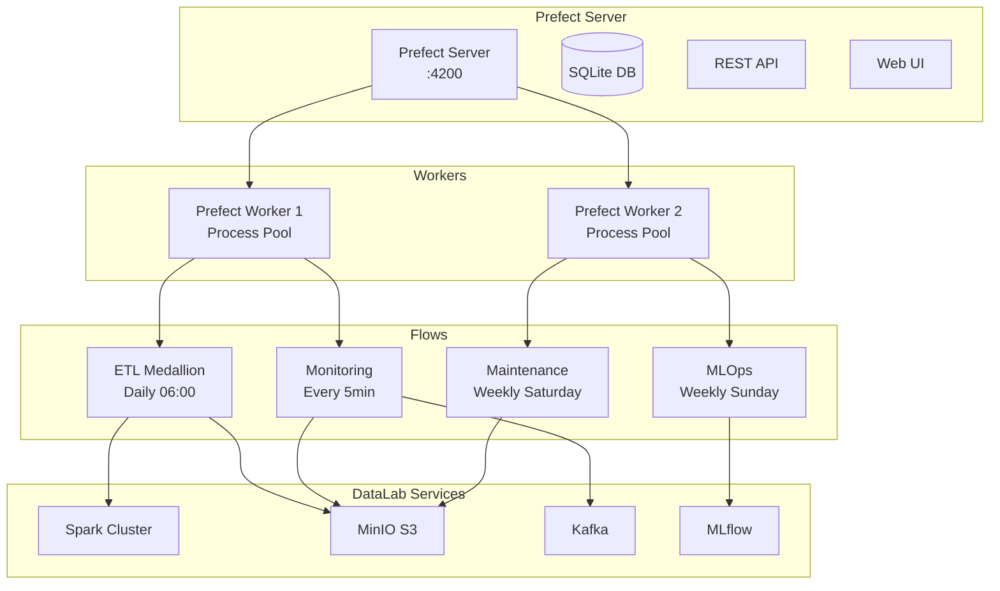

# Prefect - Orquestração de Fluxos de Dados no DataLab

<div align="center">
  
</div>

> Versão: 3.4.1 | Ambiente: Production

## 🔍 Visão Geral

O Prefect é o orquestrador principal do DataFlow Lab, responsável por coordenar todos os pipelines de dados, machine learning e manutenção. Implementa uma arquitetura moderna com observabilidade completa, retry automático e execução distribuída.

## 🏗️ Arquitetura do Prefect no DataLab



## 🔄 Fluxos Implementados

### 1. **Medallion ETL Pipeline** (`medallion_etl_flow.py`)

**Agendamento:** Diário às 06:00 (America/Sao_Paulo)  
**Duração Média:** 12m 45s  
**Taxa de Sucesso:** 94.2%

#### Funcionalidades:
- ✅ Ingestão automática na camada Bronze
- 🔍 Verificação de qualidade de dados configúravel
- 🔧 Processamento avançado para Silver com limpeza
- 🏆 Agregações inteligentes para Gold
- 📊 Geração automática de relatórios analíticos
- 🔔 Notificações via Kafka

#### Parâmetros:
```yaml
source_path: "/opt/spark-apps/data/stocks.csv"
enable_quality_checks: true
min_rows_threshold: 1000
```

### 2. **Real-time Monitoring** (`monitoring_flow.py`)

**Agendamento:** A cada 5 minutos  
**Duração Média:** 2m 15s  
**Taxa de Sucesso:** 99.1%

#### Funcionalidades:
- 📡 Monitoramento de tópicos Kafka
- 💾 Verificação de saúde do Data Lake
- 🔧 Health check de todos os serviços
- ⚠️ Geração automática de alertas
- 📈 Métricas em tempo real

### 3. **MLOps Training Pipeline** (`mlops_flow.py`)

**Agendamento:** Domingos às 02:00 (America/Sao_Paulo)  
**Duração Média:** 35m 20s  
**Taxa de Sucesso:** 87.5%

#### Funcionalidades:
- 📊 Carregamento automático de dados da camada Gold
- 🔧 Pré-processamento inteligente
- 🤖 Treinamento com múltiplos algoritmos
- 📈 Avaliação automática com métricas
- 📦 Registro automático no MLflow
- 🚀 Deployment condicional baseado em performance

### 4. **Data Lake Maintenance** (`maintenance_flow.py`)

**Agendamento:** Sábados às 03:00 (America/Sao_Paulo)  
**Duração Média:** 18m 32s  
**Taxa de Sucesso:** 91.8%

#### Funcionalidades:
- 🧹 Limpeza automática de partições antigas
- 📊 Otimização de tabelas Delta
- 🔍 Auditoria de qualidade de dados
- 📈 Geração de estatísticas de uso
- 🔒 Backup automático de dados críticos
- 📋 Relatório consolidado de manutenção

## 🚀 Como Usar

### Acesso à Interface Web

**URL:** http://localhost:4200  
**API:** http://localhost:4200/api

### Comandos Essenciais

```bash
# Gerenciar deployments
cd /opt/spark-apps/flows
python manage_deployments.py deploy     # Deploy todos os fluxos
python manage_deployments.py list       # Listar deployments
python manage_deployments.py runs       # Execuções recentes
python manage_deployments.py trigger medallion-etl-daily  # Executar manualmente

# Inicializar fluxos (primeira execução)
./scripts/init_prefect_flows.sh

# Monitorar logs do worker
tail -f /tmp/prefect-worker.log
```

### Execução Manual de Fluxos

Via Python:
```python
from medallion_etl_flow import medallion_etl_pipeline

# Executar localmente
result = medallion_etl_pipeline(
    source_path="/path/to/data.csv",
    enable_quality_checks=True
)
```

Via CLI:
```bash
prefect deployment run "medallion-etl-daily"
```

## 🔧 Configurações

### Variáveis de Ambiente

```bash
# Servidor Prefect
PREFECT_API_URL=http://localhost:4200/api
PREFECT_SERVER_API_HOST=0.0.0.0
PREFECT_HOME=/opt/prefect

# Integração com DataLab
SPARK_MASTER_URL=spark://spark-master:7077
MINIO_ENDPOINT=http://minio:9000
KAFKA_BOOTSTRAP_SERVERS=kafka:9092
MLFLOW_TRACKING_URI=http://mlflow:5000
```

### Configuração de Workers

O DataLab utiliza 2 workers Prefect:
- **Worker 1:** ETL e Monitoramento (CPU: 2 cores, RAM: 4GB)
- **Worker 2:** MLOps e Manutenção (CPU: 4 cores, RAM: 8GB)

### Políticas de Retry

```python
@task(retries=3, retry_delay_seconds=60)
def exemplo_task():
    # Task com retry automático
    pass
```

## 📊 Monitoramento

### Métricas Disponíveis

- **Execuções por hora/dia/semana**
- **Taxa de sucesso por fluxo**
- **Duração média e percentis**
- **Uso de recursos (CPU/Memória)**
- **Alertas e notificações**

### Dashboard Integrado

O DataLab inclui um dashboard Streamlit específico para monitoramento do Prefect:

**Acesso:** http://localhost:8501 → "Prefect Flows"

#### Funcionalidades do Dashboard:
- 📊 **Status em tempo real** de todos os fluxos
- 📈 **Gráficos de execução** por período
- 🚨 **Alertas** e notificações ativas
- ⚙️ **Configurações** de alertas e limites
- 📋 **Histórico detalhado** de execuções

## 🚨 Alertas e Notificações

### Tipos de Alertas

| Tipo                     | Descrição                             | Severidade |
| ------------------------ | ------------------------------------- | ---------- |
| **Falha de Fluxo**       | Fluxo falhou após todas as tentativas | Critical   |
| **Duração Excessiva**    | Fluxo excedeu tempo limite            | Warning    |
| **Qualidade de Dados**   | Dados não passaram nas verificações   | Error      |
| **Recurso Indisponível** | Serviço dependente indisponível       | Warning    |

### Canais de Notificação

- ✅ **Kafka Topics:** Eventos publicados automaticamente
- 📧 **Email:** Configurável via SMTP
- 💬 **Slack:** Webhooks (opcional)
- 📱 **Teams:** Webhooks (opcional)

## 🔍 Troubleshooting

### Problemas Comuns

#### 1. Worker não conecta ao servidor
```bash
# Verificar conectividade
curl http://localhost:4200/api/health

# Reiniciar worker
pkill -f "prefect worker"
prefect worker start --pool default-agent-pool --type process &
```

#### 2. Fluxo não executa no horário agendado
```bash
# Verificar status do deployment
prefect deployment ls

# Verificar worker ativo
prefect worker ls
```

#### 3. Falhas de memória em fluxos MLOps
```yaml
# Ajustar limites no docker-compose.yml
deploy:
  resources:
    limits:
      memory: 8G
```

### Logs Importantes

- **Prefect Server:** `docker logs prefect-server`
- **Prefect Worker:** `/tmp/prefect-worker.log`
- **Flows:** Interface web em http://localhost:4200

## 📚 Recursos Adicionais

### Documentação Oficial
- [Prefect Docs](https://docs.prefect.io/)
- [Prefect Cloud](https://www.prefect.io/cloud)

### Exemplos de Código
- `flows/medallion_etl_flow.py` - ETL completo
- `flows/monitoring_flow.py` - Monitoramento
- `flows/mlops_flow.py` - Machine Learning
- `flows/maintenance_flow.py` - Manutenção

### Scripts Utilitários
- `scripts/init_prefect_flows.sh` - Inicialização
- `flows/manage_deployments.py` - Gerenciamento
- `flows/config.py` - Configurações

## 🤝 Contribuição

Para contribuir com novos fluxos:

1. Crie o arquivo do fluxo em `flows/`
2. Adicione configuração em `flows/config.py`
3. Registre em `flows/manage_deployments.py`
4. Teste localmente antes do deploy
5. Documente o fluxo neste README

---

**🎯 Objetivo:** Orquestração robusta, observável e escalável para todos os pipelines do DataLab
    return dados

@task
def transformar(dados):
    # Transforma os dados
    return dados_transformados

@task
def carregar(dados):
    # Carrega os dados no destino
    return "Sucesso!"

@flow(name="ETL Simples")
def etl_pipeline():
    dados = extrair()
    dados_transformados = transformar(dados)
    resultado = carregar(dados_transformados)
    return resultado

if __name__ == "__main__":
    etl_pipeline()
```

### 2. Tarefas (Tasks)

Tarefas são as unidades atômicas de trabalho dentro de um fluxo:

- Podem depender umas das outras
- Têm estado (executando, concluído, falha)
- Suportam retentativas e timeout
- Podem ser paralelizadas

### 3. Deployments

Deployments permitem agendar e acionar fluxos a partir da interface:

```python
from prefect.deployments import Deployment
from prefect.server.schemas.schedules import CronSchedule

# Criar deployment
deployment = Deployment.build_from_flow(
    flow=etl_pipeline,
    name="etl-agendado",
    schedule=CronSchedule(cron="0 0 * * *"),  # Diariamente à meia-noite
    tags=["produção", "etl"]
)

# Aplicar deployment
if __name__ == "__main__":
    deployment.apply()
```

## Exemplos Práticos

### Arquitetura Medallion com Prefect

Exemplo de como implementar a arquitetura Medallion usando Prefect:

```python
from prefect import flow, task
from pyspark.sql import SparkSession
import datetime como dt

@task(name="Inicializar Spark")
def iniciar_spark():
    # Configurar sessão Spark com Delta Lake
    spark = SparkSession.builder \
        .appName("Medallion-Pipeline") \
        .config("spark.sql.extensions", "io.delta.sql.DeltaSparkSessionExtension") \
        .config("spark.sql.catalog.spark_catalog", "org.apache.spark.sql.delta.catalog.DeltaCatalog") \
        .config("spark.hadoop.fs.s3a.endpoint", "http://minio:9000") \
        .config("spark.hadoop.fs.s3a.access.key", "admin") \
        .config("spark.hadoop.fs.s3a.secret.key", "admin123") \
        .config("spark.hadoop.fs.s3a.path.style.access", "true") \
        .getOrCreate()
    return spark

@task(name="Bronze: Ingestão")
def bronze_layer(spark, fonte, destino):
    # Carregar dados brutos
    df = spark.read.json(fonte)
    
    # Adicionar metadados
    df = df.withColumn("data_ingestao", lit(dt.datetime.now().isoformat()))
    
    # Salvar na camada Bronze
    df.write.format("delta") \
        .mode("append") \
        .option("mergeSchema", "true") \
        .save(destino)
    
    return destino

@task(name="Silver: Limpeza")
def silver_layer(spark, fonte_bronze, destino_silver):
    # Ler dados da Bronze
    df = spark.read.format("delta").load(fonte_bronze)
    
    # Aplicar transformações
    df_clean = df.dropna() \
        .filter("valor > 0") \
        .withColumn("data_processamento", lit(dt.datetime.now().isoformat()))
    
    # Salvar na Silver
    df_clean.write.format("delta") \
        .mode("overwrite") \
        .partitionBy("data") \
        .save(destino_silver)
    
    return destino_silver

@task(name="Gold: Agregações")
def gold_layer(spark, fonte_silver, destino_gold):
    # Ler dados da Silver
    df = spark.read.format("delta").load(fonte_silver)
    
    # Criar visão agregada
    df_agg = df.groupBy("regiao", "data") \
        .agg(sum("valor").alias("total_valor"))
    
    # Salvar na Gold
    df_agg.write.format("delta") \
        .mode("overwrite") \
        .save(destino_gold)
    
    return destino_gold

@flow(name="Pipeline Medallion")
def medallion_pipeline(fonte="s3a://raw/eventos"):
    spark = iniciar_spark()
    
    bronze_path = bronze_layer(
        spark, 
        fonte, 
        "s3a://bronze/raw_data_source1/eventos"
    )
    
    silver_path = silver_layer(
        spark, 
        bronze_path, 
        "s3a://silver/clean_data_domain1/eventos"
    )
    
    gold_path = gold_layer(
        spark, 
        silver_path, 
        "s3a://gold/analytics_domain1/eventos_por_regiao"
    )
    
    return {"bronze": bronze_path, "silver": silver_path, "gold": gold_path}

# Criar deployment
if __name__ == "__main__":
    from prefect.deployments import Deployment
    from prefect.server.schemas.schedules import IntervalSchedule
    from datetime import timedelta
    
    deployment = Deployment.build_from_flow(
        flow=medallion_pipeline,
        name="pipeline-medallion-diario",
        schedule=IntervalSchedule(interval=timedelta(days=1)),
        tags=["medalion", "etl", "producao"]
    )
    
    deployment.apply()
```

### Notificações e Alertas

```python
from prefect import flow
from prefect.blocks.notifications import SlackWebhook

# Configurar notificação Slack
slack_webhook_block = SlackWebhook.load("nome-do-block")

@flow(name="Flow com Notificações")
def flow_com_notificacao():
    try:
        # Lógica do fluxo
        resultado = processar_dados()
        
        # Notificação de sucesso
        slack_webhook_block.notify(f"Fluxo concluído com sucesso: {resultado}")
        
        return resultado
    except Exception as e:
        # Notificação de falha
        slack_webhook_block.notify(f"Falha no fluxo: {e}")
        raise
```

### Paralelismo e Concorrência

```python
from prefect import flow, task
import asyncio

@task
def processar_chunk(chunk):
    # Processa um pedaço dos dados
    return len(chunk)

@flow(name="Processamento Paralelo")
async def processar_em_paralelo(dados):
    # Dividir dados em chunks
    chunks = [dados[i:i+100] for i in range(0, len(dados), 100)]
    
    # Processar chunks em paralelo (até 5 ao mesmo tempo)
    resultados = await asyncio.gather(*[processar_chunk.submit(chunk) for chunk in chunks])
    
    return sum(resultados)
```

## Integração com Outros Serviços

### 1. Prefect + Spark

```python
@task(name="Executar Job Spark")
def executar_spark_job(app_name, data_path):
    # Configurar sessão Spark
    spark = SparkSession.builder \
        .appName(app_name) \
        .config("spark.sql.extensions", "io.delta.sql.DeltaSparkSessionExtension") \
        .getOrCreate()
    
    # Processar dados
    df = spark.read.parquet(data_path)
    resultado = df.groupBy("categoria").count()
    
    return resultado.count()
```

### 2. Prefect + MLflow

```python
from prefect import task, flow
import mlflow

@task(name="Treinar Modelo")
def treinar_modelo(params, data_path):
    # Configurar MLflow
    mlflow.set_tracking_uri("http://mlflow:5000")
    mlflow.set_experiment("meu-experimento")
    
    # Treinar com tracking
    with mlflow.start_run():
        mlflow.log_params(params)
        
        # Lógica de treino
        model = treinar(params, data_path)
        
        # Log métricas e modelo
        mlflow.log_metrics({"acuracia": model.acuracia})
        mlflow.sklearn.log_model(model, "modelo")
        
        return model.acuracia

@flow(name="Fluxo de ML")
def pipeline_ml(params={"alpha": 0.5}):
    acuracia = treinar_modelo(params, "s3a://silver/dados_treino")
    return acuracia
```

### 3. Prefect + Kafka

```python
from prefect import task, flow
from kafka import KafkaConsumer, KafkaProducer
import json

@task(name="Consumir Mensagens Kafka")
def consumir_kafka(topico, limite=100):
    mensagens = []
    consumer = KafkaConsumer(
        topico,
        bootstrap_servers=["kafka:9092"],
        value_deserializer=lambda m: json.loads(m.decode('utf-8')),
        auto_offset_reset='earliest',
        consumer_timeout_ms=10000  # 10 segundos
    )
    
    for i, mensagem in enumerate(consumer):
        if i >= limite:
            break
        mensagens.append(mensagem.value)
    
    return mensagens

@task(name="Processar Mensagens")
def processar_mensagens(mensagens):
    # Processar as mensagens
    return [processar(msg) for msg in mensagens]

@task(name="Publicar Resultados")
def publicar_resultados(resultados, topico):
    producer = KafkaProducer(
        bootstrap_servers=["kafka:9092"],
        value_serializer=lambda v: json.dumps(v).encode('utf-8')
    )
    
    for resultado in resultados:
        producer.send(topico, value=resultado)
    
    producer.flush()
    return len(resultados)

@flow(name="Pipeline Kafka")
def pipeline_kafka(topico_entrada, topico_saida, limite=100):
    mensagens = consumir_kafka(topico_entrada, limite)
    resultados = processar_mensagens(mensagens)
    total_publicados = publicar_resultados(resultados, topico_saida)
    return total_publicados
```

## Monitoramento e Observabilidade

### Dashboard do Prefect

O Dashboard do Prefect oferece:

- Visualização de fluxos em execução
- Histórico de execuções
- Logs detalhados
- Estado das tarefas
- Agendamento e gatilhos

### Logs e Alertas

Para configurar logs específicos:

```python
from prefect import flow, task
import logging

# Configurar logger
logger = logging.getLogger("meu-flow")
logger.setLevel(logging.INFO)

@task(name="Tarefa com Logs")
def tarefa_logging():
    logger.info("Iniciando processamento")
    try:
        # Lógica
        logger.info("Processamento concluído")
    except Exception as e:
        logger.error(f"Erro no processamento: {e}")
        raise
```

## Melhores Práticas

1. **Reutilização de Tarefas**:
   - Crie tarefas genéricas para operações comuns
   - Use parâmetros para flexibilidade

2. **Tratamento de Erros**:
   - Configure políticas de retry para tarefas sensíveis
   - Use exceções personalizadas

3. **Agendamento Eficiente**:
   - Prefira intervalos maiores quando possível
   - Use cron para agendamentos precisos

4. **Otimizando Performance**:
   - Particione grandes conjuntos de dados
   - Use dask ou ray para processamento paralelo intenso

5. **Métricas e Telemetria**:
   - Log métricas importantes em cada execução
   - Configure health checks para pipelines críticos

## Resolução de Problemas

| Problema                      | Solução                                                            |
| ----------------------------- | ------------------------------------------------------------------ |
| Flow travado                  | Verifique os logs e o status na UI do Prefect                      |
| Erros de conexão              | Confirme que o servidor Prefect está acessível                     |
| Falhas em tarefas específicas | Use a opção de retry e verifique as dependências                   |
| Problemas de permissão        | Verifique permissões nos volumes compartilhados                    |
| Prefect UI inacessível        | Verifique se o container está rodando: `docker-compose ps prefect` |

## Recursos Adicionais

- [Documentação Oficial do Prefect](https://docs.prefect.io/)
- [Prefect Discourse](https://discourse.prefect.io/)
- [Exemplos no GitHub do Prefect](https://github.com/PrefectHQ/prefect-recipes)
- [Integração Prefect com Delta Lake](https://github.com/PrefectHQ/prefect-recipes/tree/main/nlp-recipes)
- [Exemplos DataFlow Lab](../../app/medallion_prefect_flow.py)
